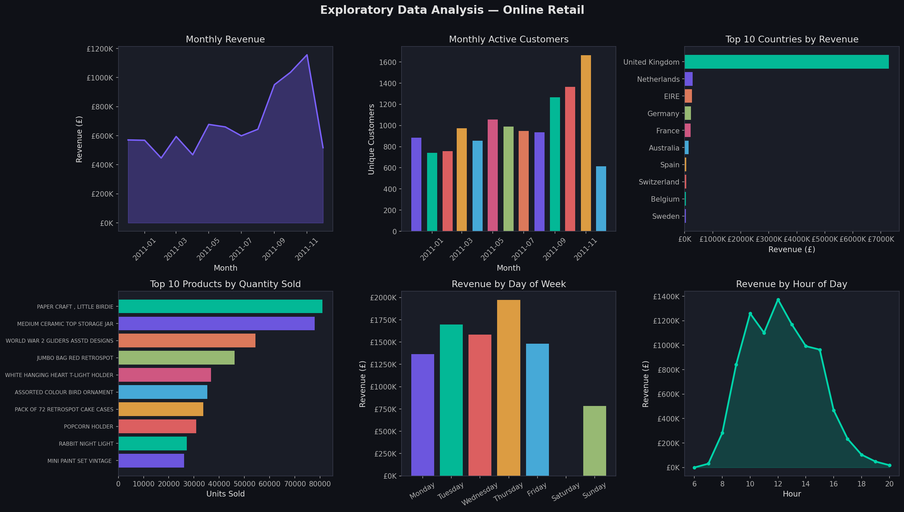
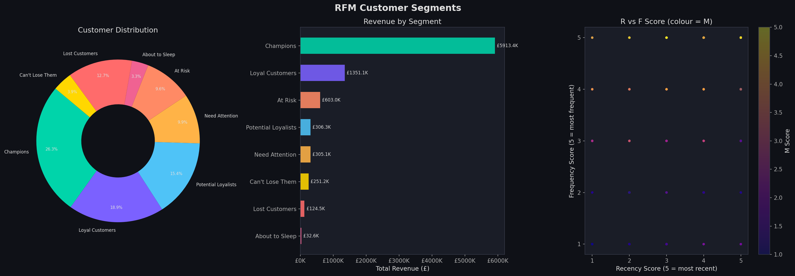
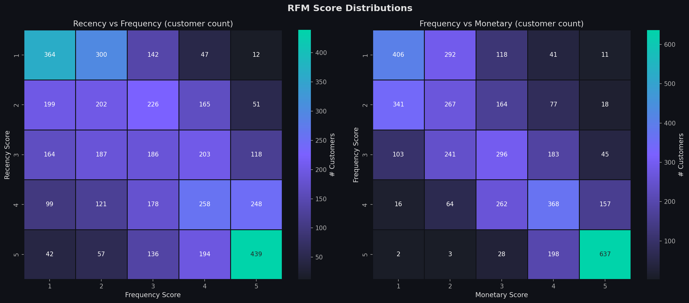
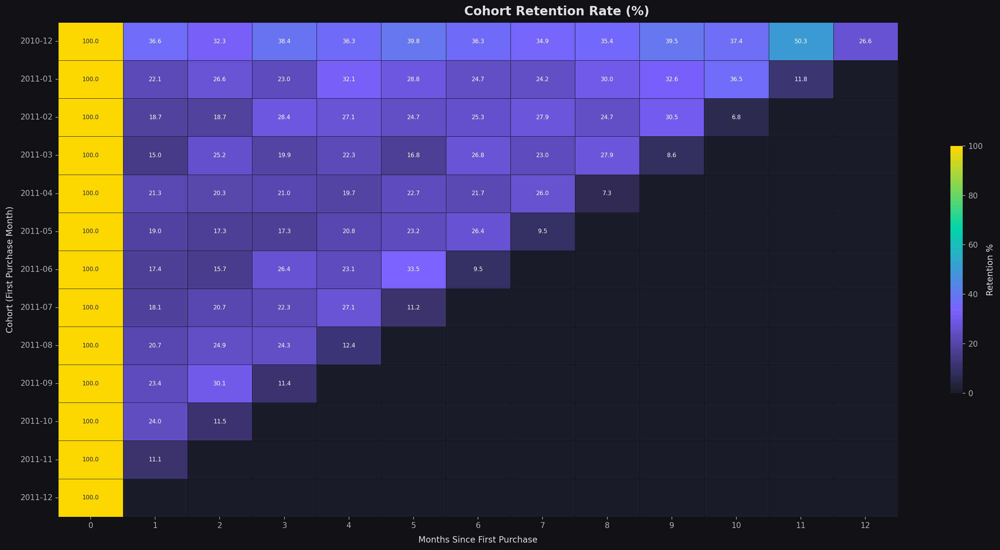
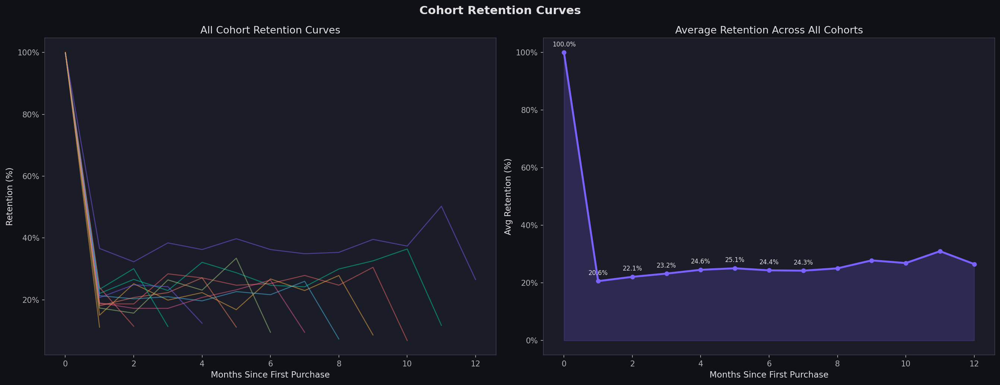

# 🛒 RFM & Cohort Analysis — Online Retail Customer Analytics

> End-to-end customer analytics project on a real-world UK e-commerce dataset.  
> Segments 4,338 customers using RFM scoring and tracks cohort retention across 13 months.


---

## 📌 Project Overview

This project applies **RFM (Recency, Frequency, Monetary)** analysis and **Cohort Analysis**
to 541,909 retail transactions from a UK-based online store (Dec 2010 – Dec 2011).

The goal is to move beyond aggregate sales metrics and understand *who* the customers are,
*how* they behave, and *where* the business is losing them.

---

## 📂 Repository Structure
rfm-cohort-analysis/

├── rfm_cohort_analysis.py      # Complete analysis script

├── rfm_cohort_report.md        # Academic project report

├── README.md

├── outputs/

│   ├── 01_eda_overview.png

│   ├── 02_rfm_segments.png

│   ├── 03_rfm_heatmaps.png

│   ├── 04_rfm_distributions.png

│   ├── 05_segment_profiles.png

│   ├── 06_cohort_retention_heatmap.png

│   ├── 07_cohort_retention_curves.png

│   ├── 08_cohort_revenue.png

│   ├── rfm_scores.csv

│   ├── segment_summary.csv

│   └── cohort_retention.csv

└── data/

└── README.md               # Dataset download instructions

---

## 🗂️ Dataset

**Source:** [Online Retail — UCI Machine Learning Repository](https://archive.ics.uci.edu/dataset/352/online+retail)

| Attribute | Detail |
|---|---|
| Transactions | 541,909 rows |
| Columns | InvoiceNo, StockCode, Description, Quantity, InvoiceDate, UnitPrice, CustomerID, Country |
| Period | December 2010 – December 2011 |
| Geography | 37 countries; United Kingdom ~91% of revenue |

> Download `OnlineRetail.csv` from the link above and place it in the `data/` folder before running the script.

---

## ⚙️ How to Run

```bash
# 1. Clone the repository
git clone https://github.com/YOUR_USERNAME/rfm-cohort-analysis.git
cd rfm-cohort-analysis

# 2. Install dependencies
pip install pandas numpy matplotlib seaborn

# 3. Place the dataset
# Download OnlineRetail.csv from UCI and put it in data/

# 4. Run the analysis
python rfm_cohort_analysis.py
```

All 8 visualisations and 3 CSV outputs will be saved to the `outputs/` folder.

---

## 🧹 Data Cleaning

| Issue | Records |
|---|---|
| Missing CustomerID (guest orders) | 135,080 removed |
| Cancellations (InvoiceNo starts with 'C') | 9,288 removed |
| Negative quantity (returns/adjustments) | 10,624 removed |
| Zero or negative UnitPrice | 2,517 removed |
| Duplicate rows | 5,268 removed |

**Clean dataset:** 392,692 transactions · 4,338 unique customers

---

## 📊 RFM Methodology

Each customer is scored on three axes using quintile binning (1–5):

| Metric | Definition | Score 5 = |
|---|---|---|
| **Recency** | Days since last purchase | Bought most recently |
| **Frequency** | Unique invoices | Bought most often |
| **Monetary** | Total spend (£) | Highest spender |

Customers are then mapped to one of 8 segments based on their R and F scores:

| Segment | Criteria | Customers | Revenue | Rev % |
|---|---|---|---|---|
| 🏆 Champions | R≥4, F≥4 | 1,139 | £5.91M | 66.5% |
| 💛 Loyal Customers | R≥3, F≥3 | 821 | £1.35M | 15.2% |
| ⚠️ At Risk | R≤2, F≥3 | 417 | £603K | 6.8% |
| 🌱 Potential Loyalists | R≥3, F≤2 | 670 | £306K | 3.4% |
| 👀 Need Attention | 2≤R≤3, 2≤F≤3 | 428 | £305K | 3.4% |
| 🚨 Can't Lose Them | R≤2, M≥3 | 168 | £251K | 2.8% |
| 💤 About to Sleep | R=2, F≤2 | 142 | £33K | 0.4% |
| ❌ Lost Customers | R≤2, F≤2 | 553 | £124K | 1.4% |

---

## 🔁 Cohort Analysis Methodology

- Each customer's **cohort** = their first purchase month
- **Cohort index** = months elapsed since first purchase (0, 1, 2 …)
- **Retention rate** = customers active at month N ÷ cohort size at month 0 × 100

---

## 📈 Key Results

- **Champions** (26% of customers) generate **66.5% of total revenue** — extreme Pareto concentration
- **Month-1 retention is only ~20.6%** — fewer than 1 in 5 new customers returns after their first purchase
- Retention stabilises at **24–30%** by month 3–6, suggesting a loyal core forms early
- **417 At-Risk customers** represent £603K in potentially recoverable revenue
- The **December 2010** cohort shows the strongest long-term retention, stabilising above 30% by month 6

---

## 💡 Business Insights

1. **Protect Champions** — 66.5% of revenue sits in 1,139 customers. A VIP loyalty programme is the highest-ROI investment.
2. **Fix month-1 retention** — A post-purchase email sequence (Day 3 / Day 7 / Day 14) could materially shift the ~20% baseline.
3. **Reactivate At-Risk customers** — Target R≤2, F≥3 customers with a time-limited discount before they cross into Lost.
4. **Convert Potential Loyalists** — 670 recent first-time buyers need a cross-sell nudge to become habitual purchasers.
5. **Invest in Q4 acquisition** — Customers acquired in Oct–Nov show stronger long-term retention; CAC is better spent then.

---

## 🖼️ Visualisations

### EDA Overview


### RFM Segment Distribution


### RFM Score Heatmaps


### Cohort Retention Heatmap


### Cohort Retention Curves


---

## 🛠️ Tech Stack

| Library | Purpose |
|---|---|
| `pandas` | Data loading, cleaning, aggregation |
| `numpy` | Numerical operations, quintile binning |
| `matplotlib` | Base plotting, layout, custom styling |
| `seaborn` | Heatmaps, statistical plots |

---

## 📄 License

MIT License — free to use, modify, and distribute with attribution.

---

## 🙋 Author

D.Trishul  
B.Tech Computer Science & Engineering  
SASTRA Deemed to be University  
